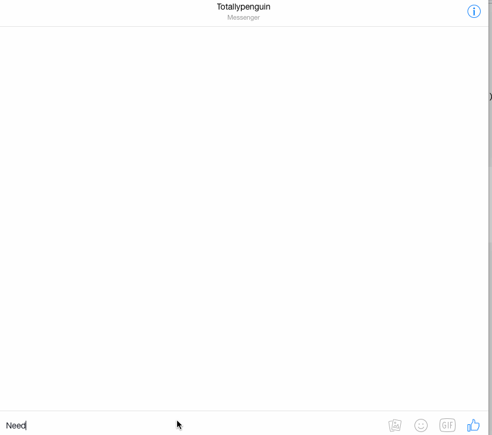

# A Penguin Facebook Messenger Bot 

### Overview
A Node.js implementation of a Penguin Facebook Messenger Bot 

Bot name: TotallyPenguin 
Bot page: [TotallyPenguin](https://www.facebook.com/Totallypenguin/)

### Aims
- Squeaks "Penguin Penguin"
- Tells Penguin jokes 
- Tells fun facts about Penguins 
- Shows cute Penguin pictures 

### To Do

See Issue Tracker :D 

### Screenshots 

### Running the app
1. Edit config.js.sample
    * Add your access token. [Here's how to obtain an access token](https://developers.facebook.com/docs/messenger-platform/quickstart)
    * Rename the file to config.js
2. `npm install` to install dependencies
3. `node app.js` on your server 
4. Start talking to Penguin!

**Notes**
* Commit regularly to Github *except for config.js*
* You can call https://expresstest-quarbby.c9users.io/imgTest to test stuff, 
i.e. see console output without running the bot

### Resources
- [Facebook Messenger Bots](https://developers.facebook.com/docs/messenger-platform/product-overview)
- [Wit.ai](https://wit.ai/)
- [Node.js Express tutorial](http://www.tutorialspoint.com/nodejs/nodejs_express_framework.htm)
