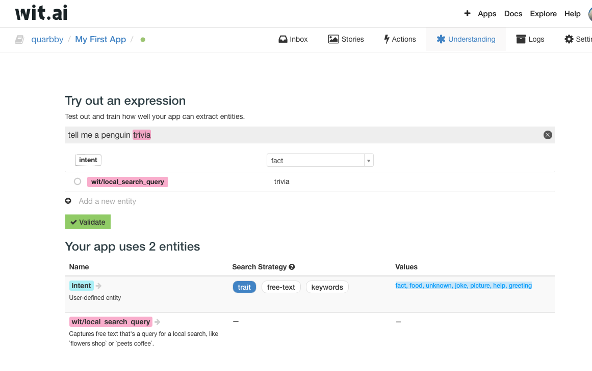

1. Go to [Wit.ai](https://wit.ai/)
2. Sign in with your Github username or if you prefer, another username 
    * Let me know your username so I can add it in 
3. Go to the Understanding tab 
   Explore the bot :D 
    * At the moment, only the *intent* is used in the bot 
4. Add some expressions and categorise them into different intents
    * There are five intents: fact, food, unknown, joke, picture, help, greeting, goodbye
    * Add expressions such that if user key in similar expressions they are categorised correctly
        * Fact: Bot will return penguin trivia 
        * Food: Bot will give penguin food, trivia on penguin eating habits, or some food photos
        * Joke: Bot will give a funny penguin photo/ gif
        * Help: Bot will show a short help text
        * Greeting: Bot will say hello 
        * Picture: Bot will show pictures of penguins
        * Unknown: Bot will randomise the return, e.g. "How about a penguin trivia?"
        * Goodbye: Bot will end chat 
        * 
